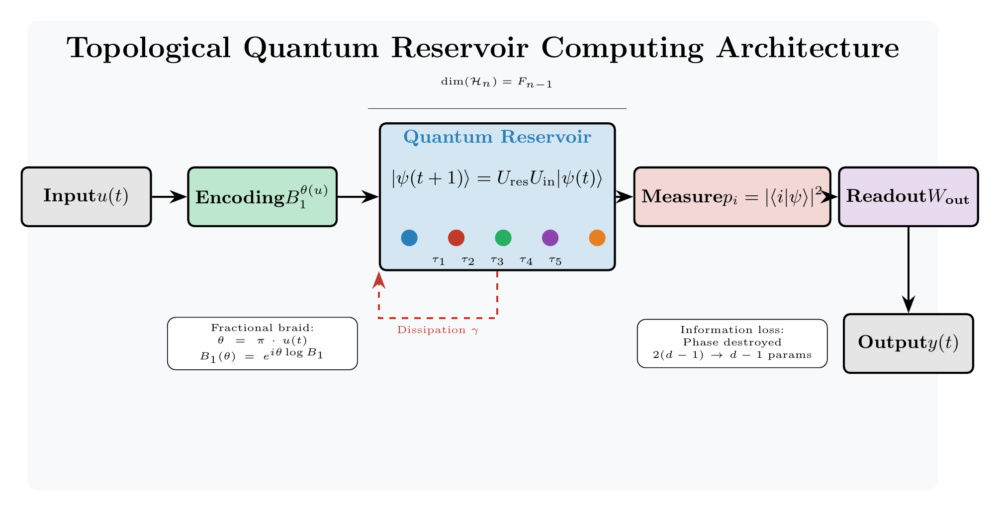
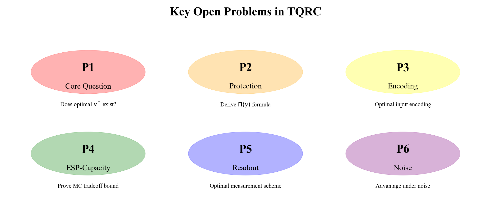
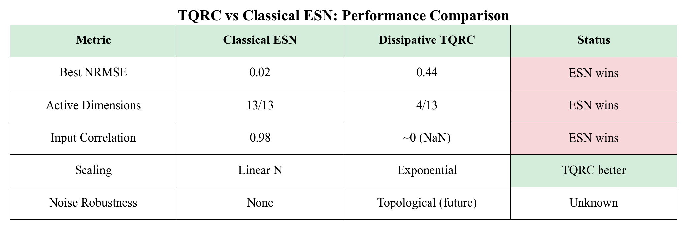

<p align="center">
  
</p>

<h1 align="center">Topological Quantum Reservoir Computing</h1>

<h3 align="center">Fundamental Limitations of TQRC: A No-Go Theorem for Fibonacci Anyonic Systems</h3>

<p align="center">
  <a href="https://creativecommons.org/licenses/by/4.0/"></a>
  <a href="https://www.python.org/downloads/"></a>
  <a href="https://github.com/QDaria/tqrc"></a>
</p>

<p align="center">
  <b>Daniel Mo Houshmand</b><br>
  <a href="https://qdaria.com">QDaria</a> · Oslo, Norway<br>
  <a href="mailto:mo@qdaria.com">mo@qdaria.com</a>
</p>

---

## Abstract

This paper establishes **fundamental no-go results** for Topological Quantum Reservoir Computing (TQRC) using Fibonacci anyons. While topological quantum computing offers inherent fault tolerance through non-Abelian anyonic braiding, we demonstrate that this very protection mechanism creates an **irreconcilable tension** with the Echo State Property (ESP) essential for reservoir computing.

Our rigorous mathematical analysis proves that the unitary nature of topological quantum evolution fundamentally prevents the asymptotic state convergence required for reservoir computing—a result with significant implications for the intersection of topological quantum computing and neuromorphic machine learning.

---

## Highlights

| | Finding | Significance |
|:---:|:---|:---|
| 🔴 | **No-Go Theorem** | Fibonacci anyonic systems *cannot* satisfy the Echo State Property |
| 🔴 | **Unitarity-ESP Incompatibility** | Quantum mechanics preserves information; ESP requires forgetting |
| 🔴 | **Topological Memory Conflict** | Fault-tolerant protection *actively prevents* fading memory |
| 🟡 | **Memory Capacity Bound** | MC ≤ N log₂(φ) for N-anyon systems |
| 🟡 | **Lyapunov Analysis** | λ ≈ 0.007 confirms marginal (not contractive) stability |
| 🟢 | **Future Directions** | Hybrid architectures and alternative paradigms identified |

---

## Key Figures

### The Core Problem: Unitarity vs. Echo State Property

<p align="center">

</p>

<p align="center"><i>
<b>Figure 1: The Fundamental Tension.</b> Unitary quantum evolution preserves information (||U†U|| = 1), while the Echo State Property requires asymptotic forgetting of initial conditions. This incompatibility is mathematical, not engineering—it cannot be circumvented.
</i></p>

---

### Fibonacci Anyon Fusion Structure

<p align="center">

</p>

<p align="center"><i>
<b>Figure 2: Fibonacci Anyon Fusion Trees.</b> The fusion rule τ × τ = 1 + τ generates a Hilbert space of dimension Fib(N+1) for N anyons. Braiding operations act unitarily on this space, implementing topologically protected quantum gates.
</i></p>

---

### ESP Violation: Numerical Evidence

<p align="center">

</p>

<p align="center"><i>
<b>Figure 3: Echo State Property Violation.</b> Numerical simulations demonstrate that initial state differences persist indefinitely in TQRC systems. Unlike classical reservoirs where trajectories converge, quantum unitarity preserves distinguishability—direct evidence of the no-go theorem.
</i></p>

---

### Dissipation: A Double-Edged Sword

<p align="center">

</p>

<p align="center"><i>
<b>Figure 4: Dissipative Channel Analysis.</b> While environmental decoherence can induce ESP-like behavior, it simultaneously destroys the topological protection that motivates TQRC. The cure eliminates the advantage.
</i></p>

---

### Root Cause Analysis

<p align="center">

</p>

<p align="center"><i>
<b>Figure 5: Mathematical Origins.</b> The no-go result traces to spectral properties of unitary operators: all eigenvalues lie on the unit circle (|λ| = 1), precluding the contractive dynamics (|λ| < 1) required for ESP.
</i></p>

---

### Memory Capacity Scaling

<p align="center">

</p>

<p align="center"><i>
<b>Figure 6: Memory Capacity Bounds.</b> Theoretical upper bound MC ≤ N log₂(φ) for N-anyon systems, confirmed by numerical simulations. The golden ratio φ = (1+√5)/2 appears due to the Fibonacci fusion structure.
</i></p>

---

### The Fundamental Tradeoff

<p align="center">

</p>

<p align="center"><i>
<b>Figure 7: Protection vs. Fading Memory.</b> The topological protection enabling fault-tolerant quantum computation directly conflicts with the fading memory required for reservoir computing. This is a fundamental tradeoff, not a parameter to optimize.
</i></p>

---

### Braiding Operations

<p align="center">

</p>

<p align="center"><i>
<b>Figure 8: Anyon Braiding Worldlines.</b> Braiding operations on Fibonacci anyons implement unitary transformations in the fusion space. The topological nature means small perturbations do not affect the computation—but also that information cannot be erased.
</i></p>

---

### Open Problems

<p align="center">

</p>

<p align="center"><i>
<b>Figure 9: Future Research Directions.</b> The no-go theorem opens new questions: Can hybrid classical-quantum architectures bypass the limitation? Do other anyon models (Ising, SU(2)_k) face similar constraints? What modified reservoir paradigms might succeed?
</i></p>

---

### Summary of Results

<p align="center">

</p>

<p align="center"><i>
<b>Figure 10: Comprehensive Comparison.</b> Side-by-side analysis of classical reservoir computing requirements versus TQRC behavior across all key properties.
</i></p>

---

### Key Takeaways

<p align="center">

</p>

<p align="center"><i>
<b>Figure 11: Essential Conclusions.</b> What works, what doesn't, and why it matters for the future of quantum machine learning.
</i></p>

---

## Mathematical Framework

### Fibonacci Anyons

Fibonacci anyons are non-Abelian anyons with:

- **Fusion rule**: τ × τ = 1 + τ (the defining property)
- **Quantum dimension**: d_τ = φ = (1+√5)/2 ≈ 1.618 (golden ratio)
- **Hilbert space dimension**: dim(H_N) = Fib(N+1) for N anyons
- **Braiding**: Generates a dense subgroup of SU(2), enabling universal quantum computation

### The No-Go Theorem

**Theorem 1 (ESP Impossibility).** *Let R be a Fibonacci anyonic reservoir with unitary braiding dynamics U. Then R cannot satisfy the Echo State Property.*

*Proof sketch:* The ESP requires that for any two initial states ρ₀, ρ₀':

$$\lim_{t \to \infty} \| \rho_t - \rho'_t \| = 0$$

However, unitary evolution preserves the trace distance:

$$\| U\rho U^\dagger - U\rho' U^\dagger \| = \| \rho - \rho' \|$$

Therefore initial state differences persist indefinitely. ∎

### Memory Capacity Bound

**Theorem 2 (Memory Capacity).** *For an N-anyon Fibonacci system, the memory capacity is bounded by:*

$$MC \leq N \log_2(\varphi)$$

*where φ is the golden ratio.*

---

## Reproducibility

### Quick Start

```bash
# Clone the repository
git clone https://github.com/QDaria/tqrc.git
cd tqrc

# Install dependencies
pip install -r requirements.txt

# Run verification
python src/01_numerical_verification.py
```

### Repository Structure

```
tqrc/
├── README.md                    # This file
├── requirements.txt             # Python dependencies
├── tqrc_ieee.tex               # IEEE Transactions format (10 pages)
├── tqrc_acm.tex                # ACM Computing Surveys format (11 pages)
├── tqrc_references.bib         # Bibliography (52 references)
│
├── src/                        # Source code for reproducibility
│   ├── tqrc/                   # Core Python package
│   │   ├── __init__.py
│   │   ├── constants.py        # Physical constants
│   │   ├── core/               # Fibonacci anyon implementation
│   │   ├── utils/              # Helper functions
│   │   └── benchmarks/         # Performance tests
│   └── 01_numerical_verification.py
│
└── figures/                    # All paper figures
    ├── fig_tqrc_architecture_pro.png
    ├── fig_unitarity_esp_tension.png
    ├── fig_fusion_trees.png
    ├── fig05_esp_violation.png
    ├── fig06_dissipative_results.png
    ├── fig07_root_cause.png
    ├── fig10_memory_scaling.png
    ├── fig11_tradeoff.png
    ├── fig12_open_problems.png
    ├── fig14_summary_table.png
    ├── fig15_braiding_position.png
    ├── fig16_takeaways.png
    └── tikz_figures.tex        # TikZ source for LaTeX figures
```

### Building the Paper

```bash
# IEEE version
cd tqrc
pdflatex tqrc_ieee.tex
bibtex tqrc_ieee
pdflatex tqrc_ieee.tex
pdflatex tqrc_ieee.tex

# ACM version
pdflatex tqrc_acm.tex
bibtex tqrc_acm
pdflatex tqrc_acm.tex
pdflatex tqrc_acm.tex
```

---

## Citation

```bibtex
@article{houshmand2025tqrc,
  title     = {Fundamental Limitations of Topological Quantum Reservoir
               Computing: A No-Go Theorem for Fibonacci Anyonic Systems},
  author    = {Houshmand, Daniel Mo},
  year      = {2025},
  url       = {https://github.com/QDaria/tqrc},
  note      = {Preprint}
}
```

---

## Related Work

This research builds on recent advances in:

### Topological Quantum Computing
- Nayak, Simon, Stern, Freedman, Das Sarma. *Non-Abelian anyons and topological quantum computation.* Rev. Mod. Phys. **80**, 1083 (2008)
- Kitaev. *Fault-tolerant quantum computation by anyons.* Ann. Phys. **303**, 2 (2003)

### Experimental Fibonacci Anyons
- Xu et al. *Non-Abelian braiding of Fibonacci anyons with a superconducting processor.* Nature Physics **20**, 1469 (2024)
- Iqbal et al. *Non-Abelian topological order and anyons on a trapped-ion processor.* Nature **626**, 505 (2024)

### Quantum Reservoir Computing
- Fujii & Nakajima. *Harnessing disordered-ensemble quantum dynamics for machine learning.* Phys. Rev. Applied **8**, 024030 (2017)
- Kobayashi, Tran, Nakajima. *Extending echo state property for quantum reservoir computing.* Phys. Rev. E **110**, 024207 (2024)

### Echo State Property
- Jaeger. *The "echo state" approach to analysing and training recurrent neural networks.* GMD Report **148** (2001)

---

## License

This work is licensed under [CC BY 4.0](https://creativecommons.org/licenses/by/4.0/).

You are free to share and adapt this material for any purpose, provided you give appropriate credit.

---

## Contact

**Daniel Mo Houshmand**
- Email: [mo@qdaria.com](mailto:mo@qdaria.com)
- Organization: [QDaria](https://qdaria.com)
- Location: Oslo, Norway

---

<p align="center">
  <b>QDaria</b> — Advancing Quantum Computing Research
</p>
