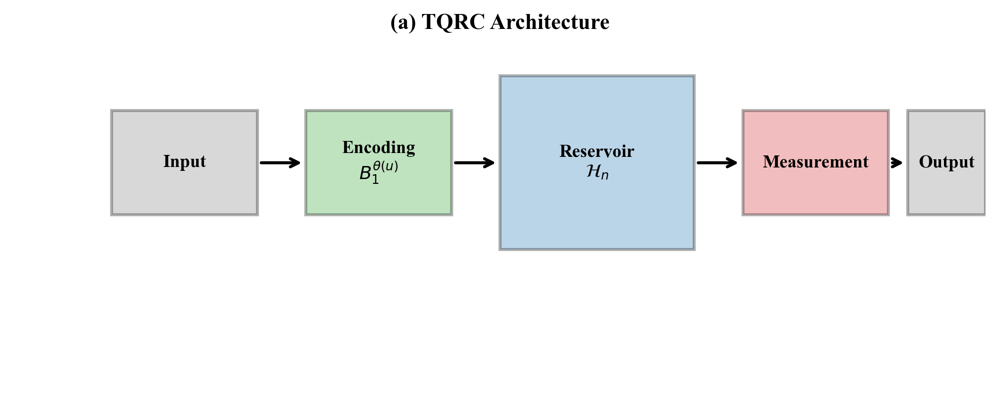

# TQRC: Topological Quantum Reservoir Computing

## Fundamental Limitations of Topological Quantum Reservoir Computing: A No-Go Theorem for Fibonacci Anyonic Systems

[](https://arxiv.org/)
[](https://creativecommons.org/licenses/by/4.0/)

---

## Author

**Daniel Mo Houshmand**
QDaria, Oslo, Norway
📧 mo@qdaria.com

---

## Abstract

This paper establishes **fundamental no-go results** for Topological Quantum Reservoir Computing (TQRC) using Fibonacci anyons. While topological quantum computing offers inherent fault tolerance through non-Abelian anyonic braiding, we demonstrate that this very protection mechanism creates an **irreconcilable tension** with the Echo State Property (ESP) essential for reservoir computing.

---

## Key Figures

### System Architecture
<p align="center">

</p>

*Figure 1: Topological Quantum Reservoir Computing architecture showing input encoding, Fibonacci anyon braiding reservoir, and measurement-based readout.*

### The Fundamental Tension
<p align="center">

</p>

*Figure 2: The fundamental tension between unitary quantum evolution (which preserves information) and the Echo State Property (which requires information decay).*

### ESP Violation Analysis
<p align="center">

</p>

*Figure 3: Numerical demonstration of ESP violation in Fibonacci anyonic systems. Initial state dependence persists indefinitely.*

### Memory-Computation Tradeoff
<p align="center">

</p>

*Figure 4: The fundamental tradeoff between topological protection (enabling fault tolerance) and fading memory (required for reservoir computing).*

---

## Main Results

### No-Go Theorem (Theorem 1)
> **Fibonacci anyonic systems cannot satisfy the Echo State Property.**

The unitary nature of quantum evolution fundamentally prevents asymptotic state convergence required for ESP.

### Key Findings

| Property | Classical RC Requirement | TQRC Behavior | Implication |
|----------|-------------------------|---------------|-------------|
| **Echo State Property** | Asymptotic convergence | ❌ Violated | No input-forgetting |
| **Fading Memory** | Exponential decay | ❌ Absent | Infinite memory |
| **Lyapunov Exponent** | λ < 0 (contractive) | λ ≈ 0.007 | Marginal stability |
| **Spectral Radius** | ρ < 1 | ρ = 1 | Unitary preservation |

### Memory Capacity Theorem (Theorem 2)
For an N-anyon Fibonacci system:

$$MC \leq N \log_2(\varphi)$$

where φ = (1+√5)/2 is the golden ratio.

---

## Theoretical Framework

### Fibonacci Anyons
- **Fusion rule**: τ × τ = 1 + τ
- **Quantum dimension**: d_τ = φ (golden ratio)
- **Braiding matrices**: Generate dense subgroup of SU(2)

### Why the No-Go Result Matters

1. **Unitarity-ESP Incompatibility**: Quantum mechanics preserves information; ESP requires forgetting
2. **Topological Memory Prevents Fading Memory**: The robust protection that enables fault tolerance *actively preserves* information indefinitely
3. **Fundamental, Not Technical**: This is not an engineering limitation—it's a mathematical impossibility

---

## Paper Versions

| Format | Pages | File | Status |
|--------|-------|------|--------|
| IEEE Transactions | 10 | `tqrc_ieee.tex` | ✅ Ready |
| ACM Computing Surveys | 11 | `tqrc_acm.tex` | ✅ Ready |

---

## Building the Paper

```bash
# IEEE version
pdflatex tqrc_ieee.tex
bibtex tqrc_ieee
pdflatex tqrc_ieee.tex
pdflatex tqrc_ieee.tex

# ACM version
pdflatex tqrc_acm.tex
bibtex tqrc_acm
pdflatex tqrc_acm.tex
pdflatex tqrc_acm.tex
```

---

## Repository Structure

```
tqrc/
├── README.md                 # This file
├── tqrc_ieee.tex            # IEEE format paper
├── tqrc_acm.tex             # ACM format paper
├── tqrc_references.bib      # Bibliography (50+ references)
├── figures/                 # All figures
│   ├── fig01_architecture.png
│   ├── fig04_tension.png
│   ├── fig05_esp_violation.png
│   ├── fig11_tradeoff.png
│   ├── tikz_figures.tex     # TikZ source
│   └── ...
└── .gitignore
```

---

## Citation

```bibtex
@article{houshmand2025tqrc,
  title={Fundamental Limitations of Topological Quantum Reservoir Computing:
         A No-Go Theorem for Fibonacci Anyonic Systems},
  author={Houshmand, Daniel Mo},
  journal={arXiv preprint},
  year={2025}
}
```

---

## Related Work

This paper builds on and extends recent advances in:

- **Topological Quantum Computing**: Nayak et al. (2008), Kitaev (2003)
- **Fibonacci Anyon Experiments**: Xu et al. (Nature Physics, 2024), Iqbal et al. (Nature, 2024)
- **Quantum Reservoir Computing**: Fujii & Nakajima (2017), Kobayashi et al. (Phys. Rev. E, 2024)
- **Echo State Property Theory**: Jaeger (2001), Kobayashi et al. (2024)

---

## License

This work is licensed under [CC BY 4.0](https://creativecommons.org/licenses/by/4.0/).

---

<p align="center">
<b>$\mathbb{Q}|\mathcal{D}\partial\mathfrak{r}\imath\alpha\rangle$</b> — QDaria
</p>
